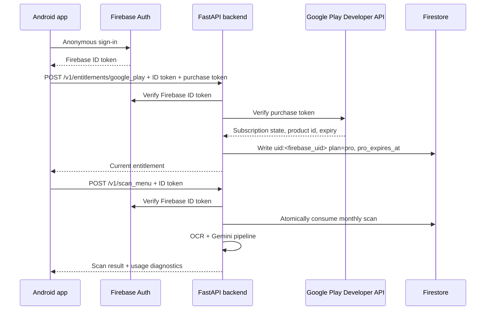

# Backend Product Milestone

This milestone turns MenuLens from a demo-style backend into a product backend:

1. Every production request is attached to a Firebase user.
2. Scan quota and Pro status live in shared Firestore storage.
3. Google Play purchase tokens are verified by the backend before Pro is granted.

## Mental Model

The client is allowed to say:

- "Here is my Firebase ID token."
- "Here is the Google Play purchase token I received after purchase or restore."

The client is not allowed to say:

- "I am Pro."
- "I have scans remaining."
- "This purchase is valid."

Those decisions belong to the backend.

## Request Flow



## Backend Config

Local development can stay on SQLite:

```env
ENABLE_FIREBASE_AUTH=false
USAGE_STORE_BACKEND=sqlite
SCAN_USAGE_DB_PATH=scan_usage.db
```

Cloud Run production should use Firebase auth and Firestore:

```env
ENABLE_FIREBASE_AUTH=true
FIREBASE_PROJECT_ID=your-firebase-project-id
USAGE_STORE_BACKEND=firestore
FIRESTORE_PROJECT_ID=your-gcp-project-id
FIRESTORE_USAGE_COLLECTION=menulens_subjects
FREE_SCAN_LIMIT_PER_MONTH=10
PRO_SCAN_LIMIT_PER_MONTH=250
```

Google Play verification also needs:

```env
PLAY_PACKAGE_NAME=com.menulens.app
PLAY_PRO_PRODUCT_IDS=menulens_pro_monthly
```

The Cloud Run runtime service account needs:

- Permission to verify Firebase tokens through Firebase Admin SDK credentials.
- Firestore read/write access.
- Android Publisher API access for the app in Google Play Console.

## Firestore Shape

The Firestore usage store writes one subject document per backend identity:

```text
menulens_subjects/{base64url(subject_key)}
```

Example subject key:

```text
uid:firebase-user-id
```

Subject document fields:

```json
{
  "subject_key": "uid:firebase-user-id",
  "plan": "pro",
  "pro_expires_at": "2099-01-01T00:00:00Z",
  "updated_at": "..."
}
```

Monthly usage subcollection:

```text
menulens_subjects/{subject}/monthly_scan_usage/{YYYY-MM}
```

Processed request idempotency subcollection:

```text
menulens_subjects/{subject}/processed_scan_requests/{request_id}
```

## Learning Checklist

1. Run locally with SQLite and auth optional.
2. Turn on Firebase auth locally after Android can reliably send bearer tokens.
3. Deploy Cloud Run with `USAGE_STORE_BACKEND=firestore`.
4. Confirm scans update Firestore monthly usage.
5. Create the subscription product in Play Console.
6. Connect Android Billing Library.
7. After purchase or restore, call `POST /v1/entitlements/google_play`.
8. Confirm Firestore changes the user from `free` to `pro`.
9. Confirm scan diagnostics report `usage_plan=pro`.
10. Remove or hide debug subscription controls from production builds.

## Endpoint Contract

`POST /v1/entitlements/google_play`

Headers:

```text
Authorization: Bearer <firebase_id_token>
```

Body:

```json
{
  "purchase_token": "token-from-google-play-billing",
  "product_id": "menulens_pro_monthly"
}
```

Successful response:

```json
{
  "plan": "pro",
  "active": true,
  "product_id": "menulens_pro_monthly",
  "subscription_state": "SUBSCRIPTION_STATE_ACTIVE",
  "pro_expires_at": "2099-01-01T00:00:00Z"
}
```

If the subscription is expired or inactive, the backend syncs the user back to `free`.
