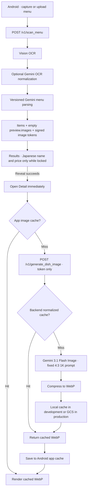

# MenuLens Request Flow

Image work is absent from the initial scan latency. Locked dishes never request
an image, and the generation endpoint accepts no arbitrary prompt. The
Show-to-Staff route uses only the Japanese dish name, 「これをください」, and
the optional price.
